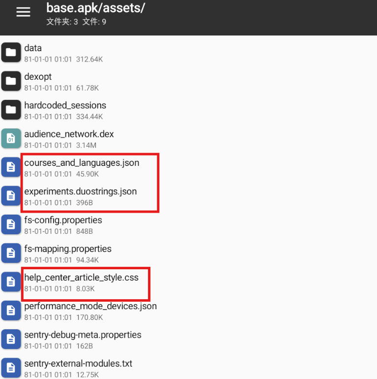
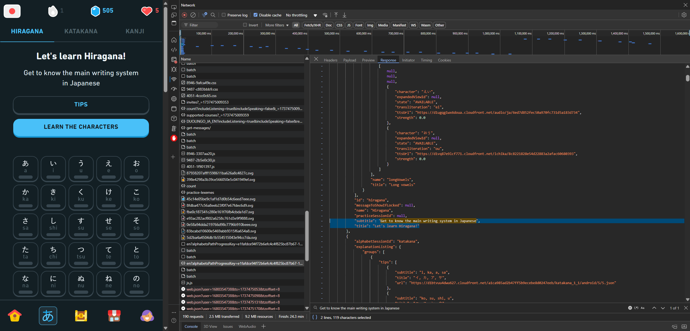
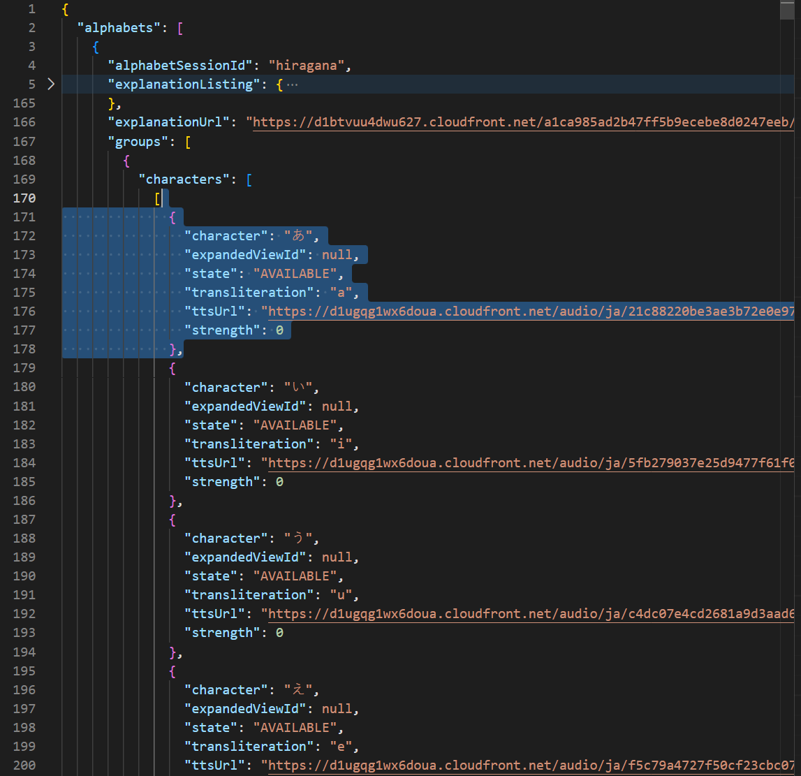
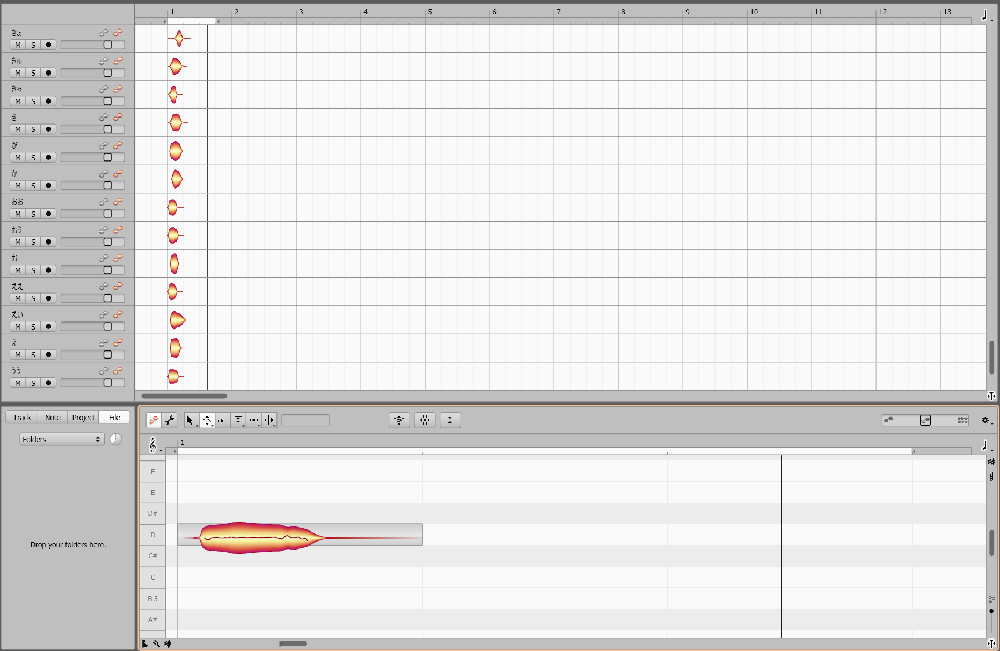

:::note[2025-05-28 更新]
已断坑。期待未来 100 年内回坑。
（忘本！！）
:::

:::note[2025-05-28 更新]
多邻国官方疑似对数据页面做了 BasicAuth 认证，导致无法通过直接网络请求获取数据。
:::

本文为实现记录。实际作者应该归于提出这个想法的人，但我也不知道[SO2](https://sulphurdxd.online)是否在继续挖这个坑。故署名于此。

# 0. 开端

某日 SO2 [aka.SulphurDXD] 跟我解释他用多邻国的日语单子学习界面的音频做人力的想法。至于想做的是什么我忘了，或许是热异常也或许是致被涂黑世界的书信。

然后当时我好像又显得很冷漠（经典剧情

然后后面不知怎的就又想起来了

总之想法都有了，那就做把

# 1. 音源获取

录屏然后截音频是我首先想到的直接方法，但是需要手动裁剪，而且需要录屏，录屏需要手动操作，手动操作需要时间，时间就是金钱，金钱就是生命，生命就是上帝，上帝就是 SO2。所以录屏音源需要 SO2。但是我没有 SO2。

所以这个方法行不通。（？）

换一个方法，是否可以干回老本行去解包？

从 APP 中初步判定，多邻国平假语音的学习页在英语学日语模式（系统语言还得是英语）的第二页，并且点击单个单词会延迟一会。可以推测出每个片假名的音频是通过网络请求的，而非本地文件。

根据多邻国官网博客的[这篇 SDUI 介绍文章](https://blog.duolingo.com/server-driven-ui/)也可以印证，APP 内所有的 UI 都是后端服务器传输过来的，因此都会通过网络更新（沟槽的 Web 还在追我）。也就是说，所有多邻国用户疑似额外装了一个浏览器到自己手机上 🤣🤣🤣【你别笑】【私人笑声 x114514】

多邻国安卓解包也相同印证了这一点。`assets/`文件里面甚至有 CSS 文件定义



那怎么办？开个 HttpCanary 抓网络包？

别急，多邻国还有网页版。



总之在游客模式下经过一番 `すし` `おちゃ` `ごはん`的洗礼过后（大号找不到密码），飞舞也是成功在 F12 开发工具的网络面板中找到了片假名页（中文系统语言没有这一页）。多邻国开发者人也怪好的，直接就把所有日语平片假和汉字的 JSON 丢回来了

日文字母页面数据 URL: `https://www-prod.duolingo.com/2017-06-30/alphabets/courses/ja/en（选填?alphabetsPathProgressKey=......）`

（是 2017 的老东西了，而且填了`alphabetsPathProgressKey`之后后面还有一堆汉字，超级大）

单个片假名数据结构如下：



可以看见 character 是对应的片假名，ttsUrl 就是音频 URL

那剩下的就很简单了，写一个 requests 爬虫把所有文件下下来然后重命名成片假名：

```python
import os
import json
import requests

output_dir = 'HiraganaFetch/output'
os.makedirs(output_dir, exist_ok=True)

# 把上面请求返回写进这个json文件，并且简化了
with open('HiraganaFetch/metadata.json', 'r', encoding='utf-8') as f:
    metadata = json.load(f)

# 只下载片假名
for group in metadata['alphabets'][0]['groups']:
    # 每行有5个片假名
    for row in group['characters']:
        for character in row:
            if character is None:
                continue
            name = character['character']
            tts_url = character['ttsUrl']
            if tts_url:
                output_file = os.path.join(output_dir, f"{name}.mp3")

            # 下载
            response = requests.get(tts_url)
            if response.status_code == 200:
                with open(output_file, 'wb') as audio_file:
                    audio_file.write(response.content)
                print(f"Downloaded: {output_file}")
            else:
                print(f"Failed to download: {tts_url}")
```

`output/` 文件夹下就是所有片假名音频。

# 2. 别样的 UTAU 音源处理大战

并非别样，是真无聊

由于我不是很相信 UTAU 的 sampler（主要是不会调），所以就全丢进 melodyne 提前拉平了

总之过程十分的枯燥



别忘了 24 位深转 16 位深单声道音频，不然 UTAU/OPENUTAU 可能会不支持格式而导致调参不保存之类的问题。（惨痛教训

```python
import os
import soundfile


def convert_wav_to_16bit(input_folder, output_folder):
    os.makedirs(output_folder, exist_ok=True)

    for filename in os.listdir(input_folder):
        if filename.endswith('.wav'):
            input_path = os.path.join(input_folder, filename)
            output_path = os.path.join(output_folder, filename)


            data, samplerate = soundfile.read(input_path)
            soundfile.write(output_path, data, samplerate, subtype='PCM_16')

convert_wav_to_16bit('Tuned/', 'Final/')
```

这样就处理的差不多了，接着丢进 UTAU

# 3. UTAU 调参

好像没什么可以写的，

# 4. 后记

知道做出来之后我才想到其实用这个人力调 Litmus\*的《学习时间到》会是一个天才想法。

毕竟很多素材可以直接从 app 里面截图（不知道怎么拿），主题也会很契合。

但有没有时间做就是另一回事了。（悲
