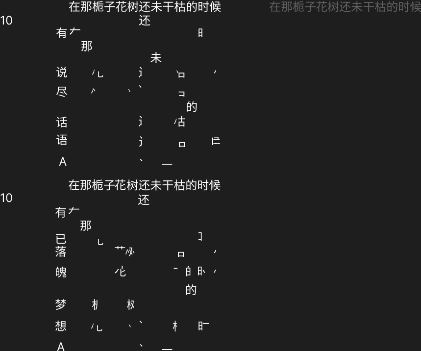
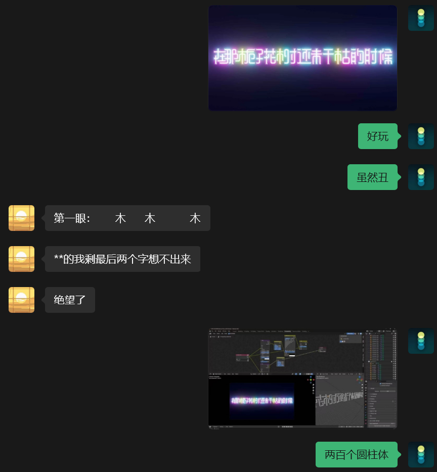
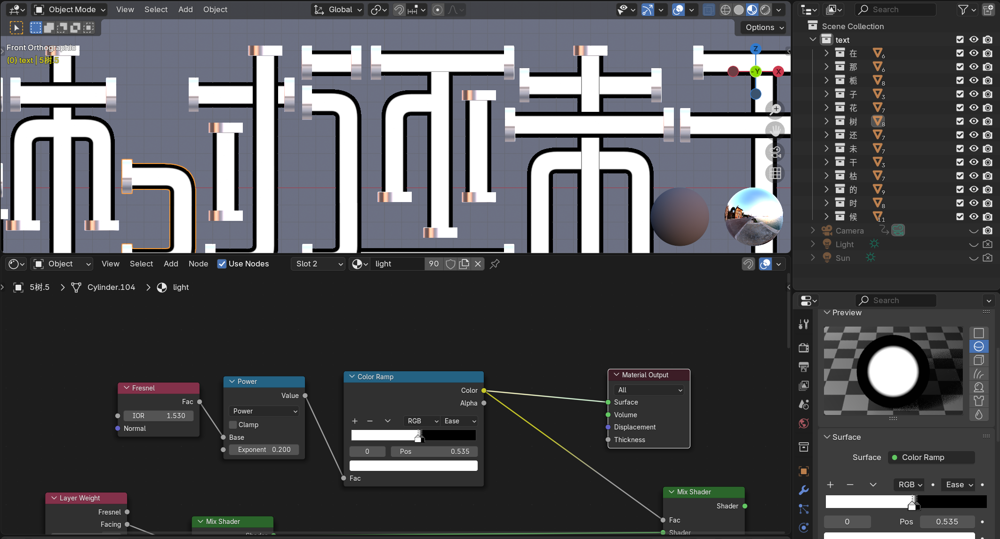
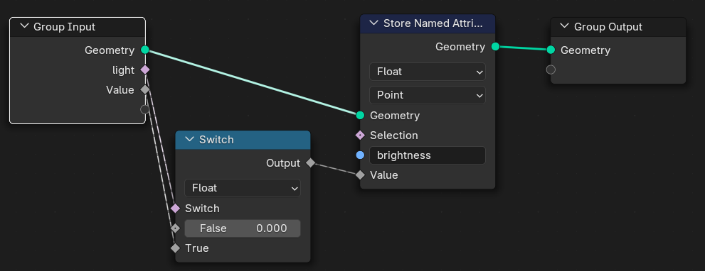
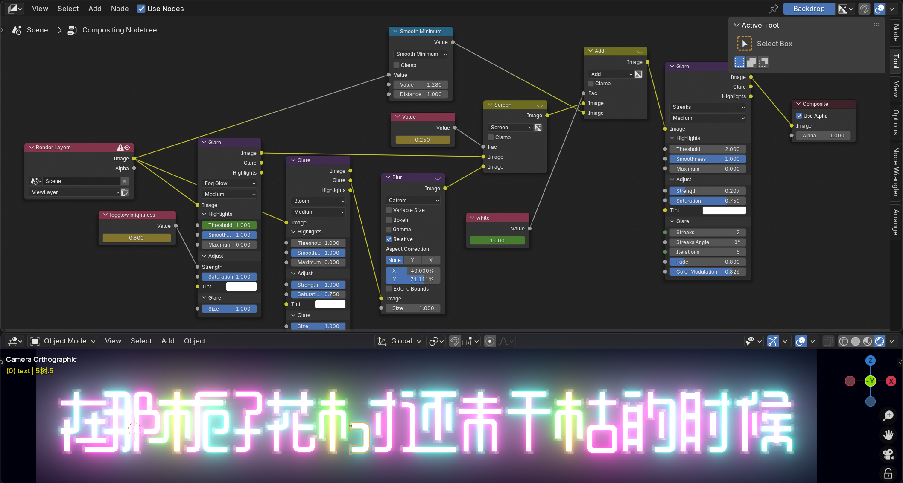
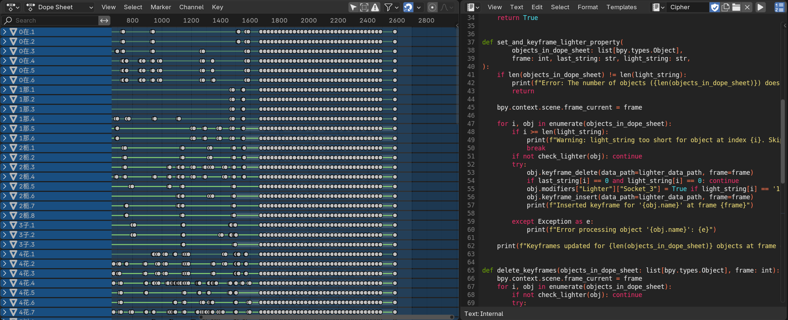
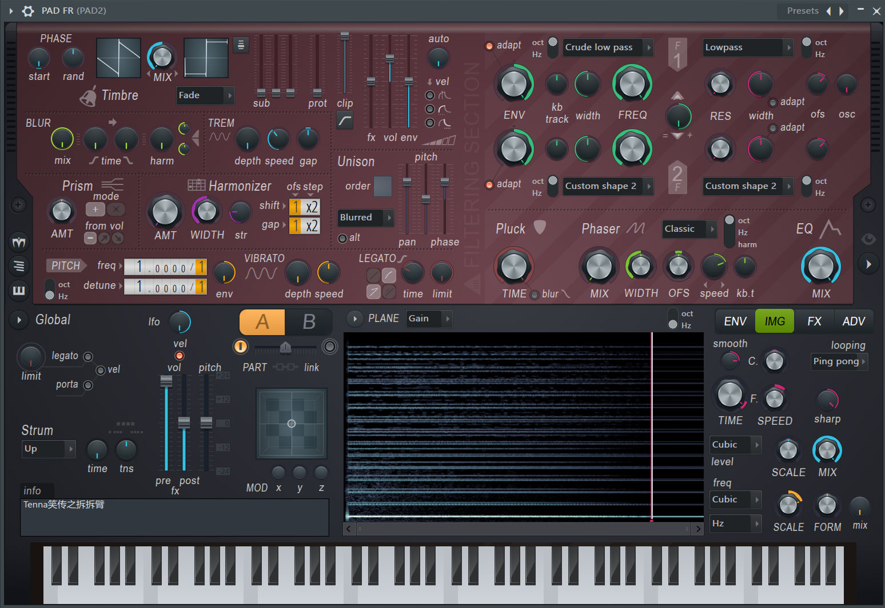

:::note[手机垃圾太多怎么办]
都说了 1800 遍了，为什么就是不听，打开这个开关自动清理手机垃圾，，，
:::
:::note[削除]
原作由于人气过高已遭削除，请自行寻找补档。
:::
:::note[素材配布]
https://pan.baidu.com/s/1b66P5h05NG0KvPeLXgIJFg?pwd=zzs2
:::

# 序

在第一次听到栀子树的时候

是在 2024 年多，当时就觉得这首曲很好听，而且莫名的比较靠近音骂。

当时创作的第一个想法是像类似于多邻国日语拼字那样，把栀子树的歌词拼出来，也算是致敬 PV 了。

结果和 fl 大战了 9961 回合之后发现完全听不了（我太菜了）遂放弃

# 起

到了栀子树热潮刚开始的时候

总之感觉有点后悔的，因为本来自己是有些想法的但是没做（其实很多项目都是这样趋势的

回想了下之前的想法，感觉也不是很可行，毕竟我根本没学日语。

那，中文呢？

抱着这样的心思，我打开 figma 画出了栀子树中文 PV 的最初版：

# 词

但是由于我垃圾的中文水平，一开始我完全找不到满意的填词

那么有没有语文比（世）较（界）好（第）的（一）人呢？

有的兄弟，有的。

以上，一场长达 4（3）天的双人合作开始了（吗？）

填词有水平的。

但由于我急着想还原 PV，结果题目没有商量好就做出来了，导致题目不可逆的有点口语化

（但我又懒得改，只能这样了（悲））

在 那 栀 子 花 树 还 未 干 枯 的 时 候

我 至 少 能 把 P V 做 出 来

# 视

制作 PV 的过程还是蛮有意思的。

第一件事情是，我为了图方便（主要是菜），所有的灯管都是复制两种圆柱体做出来的（一个是盖子，一个是管体）

拐角处单独做了一个拐弯模型，剩下的全靠拼，类似于拼好饭。（具体见封面）

其次，把外壳做出来之后我才发现原来发光的是里面那层，而为了避免做小一圈会导致的各种模型问题，我直接放弃再建一层管，
而是用 fresnel 大法在表面做了一个反描边（描边用玻璃材质，内部直接用 emission）。实际上这种方法视觉上看不出来什么问题。

然后在手 k 前面的动画时，我才意识到一点点给所有模型的材质 k 亮度完全不可取。于是我又多搞了一个专门用来传递亮度参数和开关的几何节点，
然后就可以多选要改变的模型按住 alt 开关几何节点的布尔值了。~~顺便学到了很多 blender 小技巧~~

后处理这方面我调了半天，因为原作的炫光确实很帅，color bleeding 的效果也偏高饱和度。

最后叠了一大堆 glare 和 blur 之后终于感觉差不多了。

最后那段密文动画是直接脚本生成的，我还顺便学了一下 bpy（然后修了半天 bug 终于能用了）

至于这个密文为啥那么生草，因为我没想法，然后打算直接来电搞笑的。（我不是 puzzle 专家！）

p2 ytpmv 确实很水，但我懒（第一次用 OM Midi 爽飞了）

# 音

我感觉本次音频反而有点偷懒，其一是一开始是直接对着原曲还原的，导致音 mad 成分有点少，素材也用的比较少。（fake 有点多.?）

其二是我和 SDXD 一开始打算用饼人力的，结果发现似乎对中文不是那么友好（其实我懒），再加上我急着发，于是就直接用经典葛平了（话说还撞时间线了）

当然这也是第一次我尝试在主轨上面挂 OTT（一 键 母 带）

那我还能说啥呢，直接拆拆臂

# 结

在那栀子花树还未干枯的时候

我们或许还会再次碰面吧......
